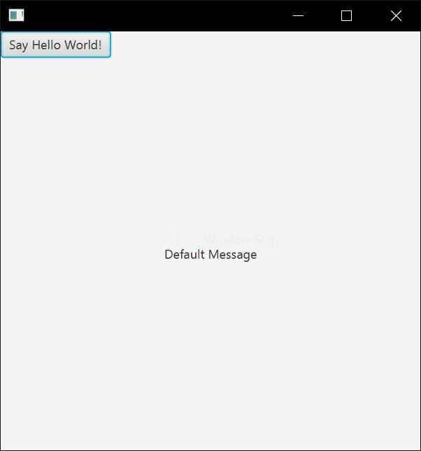
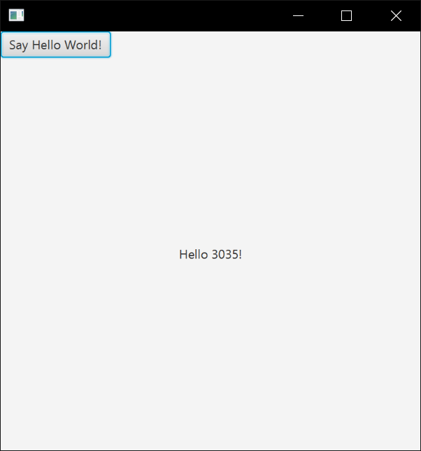

# Assignment 1 - Instructions

Complete the assignment following the instructions below. Once you have completed it push to GitHub:
[Instructions for submitting assignments on the course website](https://cs-3035-fall-2020.github.io/en_CA/#!pages/CS3035-assignments-with-git.md)

This assignment is to be done individually; each student will hand in an assignment. 

## Overview
You will build two interactive ‘hello world’ applications. One in JavaFX using code and one using code and FXML. The goal is to get you going and to test your setup of the development environment, and test the GitHub submissions.

You will be given starter code that should facilitate this exercise. Remember that you will create two separate applications that will be identical in their result. One in the HelloWorld package folder using Java code only. And, one in HelloWorldFXML that uses Java code and FXML to create all the interface components and behaviour.

See the bottom of the document for examples of what your completed assignment should look like.

## Provide Your Details

Update your details in the AUTHOR.md file. This is important because this is how we will be able to match the assignment to the student.
 
## Requirements
Build ‘hello world’ GUI systems as specified below. Both systems will show a label and a button; when the button is pressed, the label will display the text “Hello 3035!”.

It's recommended that you start with the JavaFX version with just code (i.e., no FXML), and then move on the FXML version.

## JavaFX HelloWorld
- For the JavaFX portion you will work only with the file in the provided HelloWorld directory/package.
- Create a root container (such as a BorderPane), a scene to display your root container, set the primaryStage’s scene to be your scene object, and remember to show your primaryStage. This is all done for your if you use the JavaFX Project template that is given from the step above. 
- Create a Button object (see <https://docs.oracle.com/javase/8/javafx/api/javafx/scene/control/Button.html>) 
- Create a Label object (see <https://docs.oracle.com/javase/8/javafx/api/javafx/scene/control/Label.html>) 
- Add your Button and Label to your BorderPane.  See the documentation to determine how to add like the images below: <https://docs.oracle.com/javase/8/javafx/api/javafx/scene/layout/BorderPane.html>
- Add a click handler to your button, with the following line:
```myButton.setOnAction(e -> myLabel.setText("Hello 3035"));```
- Notice that the above uses a lambda expression for an action handler. Read here for more detail: https://docs.oracle.com/javase/tutorial/java/javaOO/lambdaexpressions.html#use-case
- Once you have the first version working, then you can move onto the second version.

### For JavaFX using FXML:
- For the JavaFX with FXML portion you will work only with the file in the provided HelloWorldFXML directory/package.
- See the HelloWorld examples posted on D2L that were discussed in class.
- Edit the provided JFXML file to recreate the interface below. 
- Load a BorderPane as your root node from the FXML file from your Java code.
- To get started on the content of your FXML file, see: <https://docs.oracle.com/javafx/2/fxml_get_started/why_use_fxml.htm#CHDGAFHF>
- Add event an event handler, so that your button can change the label value (there are lots of ways to do this, but we will look at the simplest).
- First add an id to your Label element, so that your event handler will be able to reference it by name:
```<Label text="default text" fx:id="label1" />```
- Next, you will use a little bit of JavaScript (alternatively, you can use any JVM scripting language; Groovy, Kotlin, Clojure) to make the button do something, namely, change the text value of the label. Add the following inside your root node (just below the tag for your BorderPane).
```
<fx:script>
    function reactToClick() {
       label1.setText("Button clicked");
    }
</fx:script>
```
- To use JavaScript in your document… don’t forget to include a JavaScript declaration right after the XML doctype declaration:
```<?language javascript?>```

- See more on event handlers here: <https://docs.oracle.com/javase/8/javafx/api/javafx/fxml/doc-files/introduction_to_fxml.html#event_handler_attributes>

Your completed assignment should look like the interfaces below.




